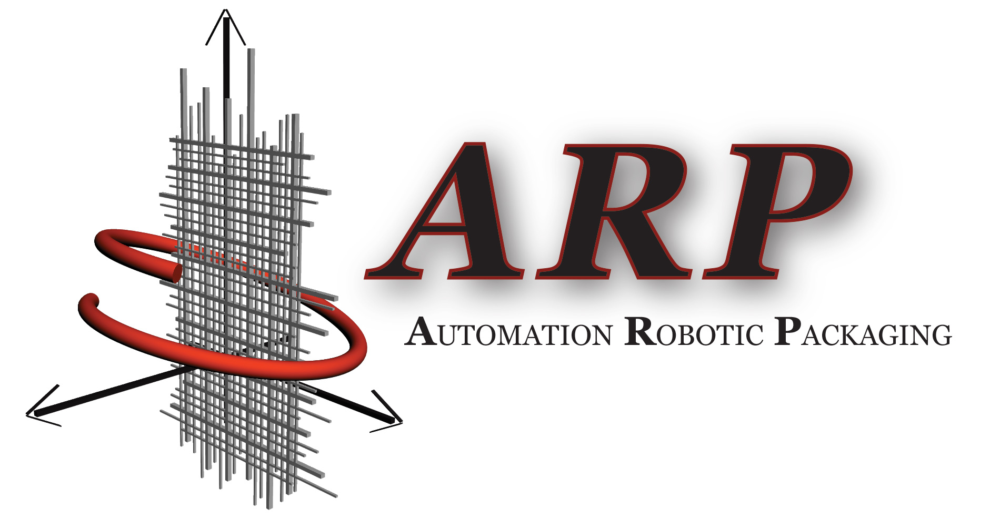
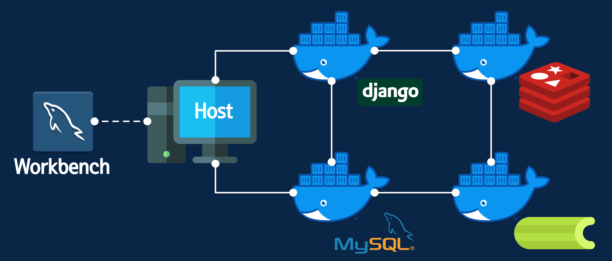
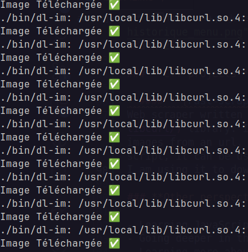

<h1 align="center">

Hello there :wave:, I'm <strong>Loïs GALLAUD
  
🔵⚪🔴    I'm a 20 years old french generalist engineering student at   <strong>Télécom Physique Strasbourg</strong>    🔵⚪🔴</strong></h1>

## 🎓 **Where do I study ?**

I'm currently studying at Télécom Physique Strasbourg, a graduate engineering school in Strasbourg, France. I'm in my 4th year of a 5 years long program, called "Cycle Ingénieur" (Engineering program). I'm currently in the generalist department specialized in Data Analysis.

  

    
    
Télécom Physique Strasbourg, Graduate Engineering School since 1970

  

---

## **📁 Professional experiences**

``

### DevOps internship: _Automation Robotic Packaging_

The goal was to **dockerizing a Django application** to deploy on any machine. The application is a web interface to manage the organization of electrical components in ARP machine projects.The goal of the internship was to make the application easy to deploy on any machine, and to make it easy to update for the developers.
**I had to learn about Docker, Django, and how to run asynchronous tasks with `Redis` and `Celery`**.

    
    
Docker structure set up for application's needs

### Software Development: _CILcare_

I worked on **`CILpink Agenda`**, a planning application for the company as part of **a contract signed with my engineering school's junior enterprise**, which facilitated my connection with the company.

---

## 💻 My computing skills

  

    

        <h3>• Web development</h3>
        
         
        
         
        <h3>• Low level programming & embedded</h3>
        
         
        
         
        <h3>• High level programming & OOP</h3>
        
         
        <h3>• DevOps</h3>
        
         
        <h3>• Databases</h3>
        
    

  

---

## 💡 **What are my main projects ?**

### **Python projects**

- #### **[MacroScrapper](https://github.com/LOISGALLAUD/MacroScrapper)**

 **Web scrapper** for [Bandcamp](https://bandcamp.com/) music. It is a Python script that will download all the free music from a Bandcamp artist page, album after album, in your Music directory.

 

- #### **[MarcoNeo](https://github.com/LOISGALLAUD/Marconeo)**

**Full Stack Python** project managing Télécom Physique Strasbourg's students' money. They store a bit of money on their student card, and can use it to buy food or drinks in the "Fouaille" (student's residence). This project is a part of my campain at TPS as Tech Vice President.

  

### **C++ projects**

- #### **[Fast-scrap](https://github.com/LOISGALLAUD/fast-scrap)**

Web scraper written in C++ using the [libcurl](https://curl.se/libcurl/) library. It is a command line tool that lets you download images from an url, and save them in a directory. When put in a script, it can be used to download a lot of images from a website.

 

I am using it to download my favorite manga scans in a few seconds.

### **Other perspectives**

- Learning JavaScript, React with NextJs, and more...
- Going deeper in the world of web development
- Learning more about databases and collecting data
- Learning more about machine learning and artificial intelligence

---

## ℹ️ GitHub Stats

  

