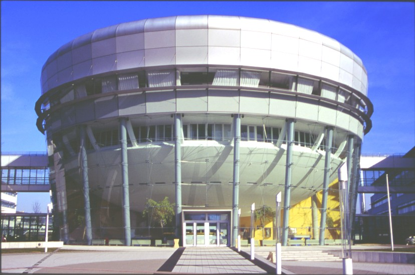
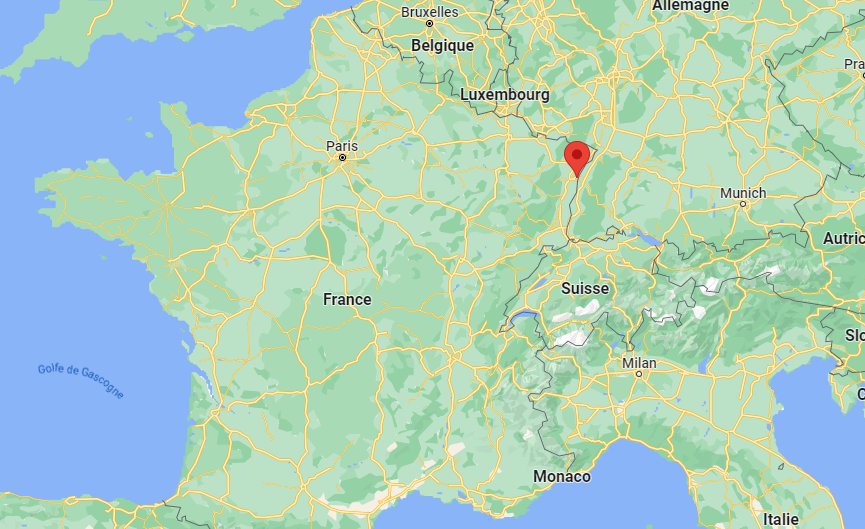

<h1 align="center">

Hello there :wave:, I'm <strong>Loïs GALLAUD
  
🔵⚪🔴   I'm a French engineering student passionate about   <strong>☁️ DevOps & Cloud Computing ☁️</strong>    🔵⚪🔴</strong></h1>

## 🐙 **Wanna know who am I ?**

I'm a 20 years old student from France, passionate about **computing** and **technology**. I'm a **curious** person, always looking for new things to learn on my own. I'm currently studying at **Télécom Physique Strasbourg**, a graduate engineering school in Strasbourg, France. I'm in my 4th year of a 5 years long program, called "Cycle Ingénieur" (Engineering program).

  

    
    
Télécom Physique Strasbourg, Graduate Engineering School since 1970

  

If you wanna know more about me, you can check my **LinkedIn** profile or my **personal website** :

  

    
  

---

## **☁️ Professional Aspirations**

I'm currently looking for a **6 months internship** in **DevOps** or **Cloud Computing**. I'm looking for a company that will allow me to **learn** and **improve** my skills in these fields.

I'm already familiar with some technos of the domain, because I've already worked on some projects related to **DevOps**, **CI/CD** and **Cloud Computing** in the past.

Currently, I'm learning with online **_IBM_** courses about **Cloud computing** and **DevOps**. I'm also planning to get some certifications in these fields; here are some of them :

---

## 💻 **Technos**

  

    

        <h3>• Web development</h3>
        
         
        
         
        <h3>• Low level programming & embedded</h3>
        
         
        
         
        <h3>• High level programming & OOP</h3>
        
         
        <h3>• DevOps, Cloud computing & CI/CD</h3>
        
         
        
        
         
        <h3>• Databases workflows</h3>
        
    

  

---

## ℹ️ GitHub Stats

  

